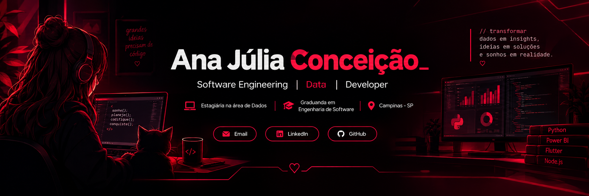

<div align="center">



<br><br>


<br><br>

<a href="mailto:anajuliaconcesilva@email.com">

</a>

<a href="https://www.linkedin.com/in/ana-conceicao-silva2007/">

</a>

<a href="https://github.com/anajuconcesilva">

</a>

</div>

<br>

---

## `> whoami`

```bash
┌──(ana㉿github)-[~/profile]
└─$ cat about_me.txt

 Nome        : Ana Júlia Conceição
 Localização : Campinas, São Paulo - Brasil
 Formação    : Engenharia de Software
 Atuação     : Estagiária na área de Dados
 Perfil      : Developer & Data Enthusiast
```

Sou **Técnica em Informática** e atualmente **graduanda em Engenharia de Software na PUC-Campinas**.

Atuo como **estagiária na área de Dados**, trabalhando com tecnologias voltadas à **análise, tratamento e visualização de dados**, com destaque para **Power BI e Python**.

Ao mesmo tempo, venho construindo minha experiência em **desenvolvimento de software**, explorando aplicações web, mobile, bancos de dados, APIs e tecnologias em nuvem.

Sou apaixonada por tecnologia e inovação e gosto de transformar **problemas em soluções, dados em informações e ideias em código**.

---

## `> what_i_do`

<table>
<tr>

<td width="50%" valign="top">

### 📊 Data & Analytics

```text
▸ Power BI
▸ Python
▸ DAX
▸ Power Query
▸ SQL
▸ Data Analysis
▸ Data Visualization
```

</td>

<td width="50%" valign="top">

### 💻 Software Development

```text
▸ Web Development
▸ Mobile Development
▸ APIs
▸ Backend
▸ Databases
▸ Cloud
▸ Software Architecture
```

</td>

</tr>
</table>

---

## `> tech_stack`

### Data & Analytics

<p>


</p>

### Web Development

<p>

&nbsp;

&nbsp;

&nbsp;

</p>


### Backend & Programming

<p>

&nbsp;

&nbsp;

&nbsp;

&nbsp;

</p>

### Mobile Development

<p>

&nbsp;

</p>

### Cloud & Databases

<p>

&nbsp;

&nbsp;

</p>

### Development Tools

<p>

&nbsp;

&nbsp;

&nbsp;

</p>

---

## `> featured_projects`

###  MesclaInvest

**Plataforma mobile de simulação de investimentos em startups.**

Projeto desenvolvido durante a graduação em Engenharia de Software, envolvendo desenvolvimento mobile, backend, banco de dados e integração com serviços em nuvem.

**Stack:**

`Flutter` `Dart` `Node.js` `TypeScript` `Firebase` `Firestore`

<br>

<a href="https://github.com/anajuconcesilva/ES-PI3-2026-T2-G08">

</a>

---

### Data & BI

Projetos acadêmicos e profissionais envolvendo **tratamento, análise e visualização de dados**, criação de indicadores e construção de dashboards.

**Stack:**

`Power BI` `Python` `DAX` `Power Query` `SQL`

---

### Web Projects

Projetos desenvolvidos para praticar criação de interfaces, lógica de programação e desenvolvimento de aplicações web.

**Stack:**

`HTML` `CSS` `JavaScript`

---

## `> education`

<table>
<tr>
<td width="60">🎓</td>
<td>

<strong>Engenharia de Software</strong><br>
PUC-Campinas · 2025 — 2028

</td>
</tr>

<tr>
<td>💻</td>
<td>

<strong>Técnica em Informática</strong><br>
Senac Campinas · 2023 — 2024

</td>
</tr>

<tr>
<td>📱</td>
<td>

<strong>Assistente de Desenvolvimento de Aplicativos Computacionais</strong><br>
Senac Campinas · 2024

</td>
</tr>

<tr>
<td>🌐</td>
<td>

<strong>Assistente de Operação de Redes de Computadores</strong><br>
Senac Campinas · 2023

</td>
</tr>
</table>

---

## `> currently_learning`

```text
╭─────────────────────────────────────────────╮
│                                             │
│  📊 Data Analytics                          │
│  ├── Power BI                               │
│  ├── Python                                 │
│  ├── DAX                                    │
│  └── Data Visualization                     │
│                                             │
│  💻 Software Engineering                    │
│  ├── Software Architecture                  │
│  ├── Algorithms & Data Structures            │
│  └── Backend Development                    │
│                                             │
│  📱 Mobile Development                      │
│  ├── Flutter                                │
│  └── Dart                                   │
│                                             │
╰─────────────────────────────────────────────╯
```

> *Aprendendo continuamente para transformar conhecimento em soluções.*

---

## `> github_stats`


</div>

<br>

<div align="center">


</div>

---

## 🐍 `> contributions`

<div align="center">


</div>

---

## 📬 `> let's_connect`

<div align="center">

### Vamos criar algo incrível? ❤️

Estou sempre aberta a aprender, compartilhar conhecimento e conhecer novas oportunidades na área de **Tecnologia, Dados e Desenvolvimento de Software**.

<br>

<a href="mailto:anajuliaconcesilva@email.com">

</a>

<a href="https://www.linkedin.com/in/ana-conceicao-silva2007/">

</a>

<a href="https://github.com/anajuconcesilva">

</a>

<br><br>


</div>